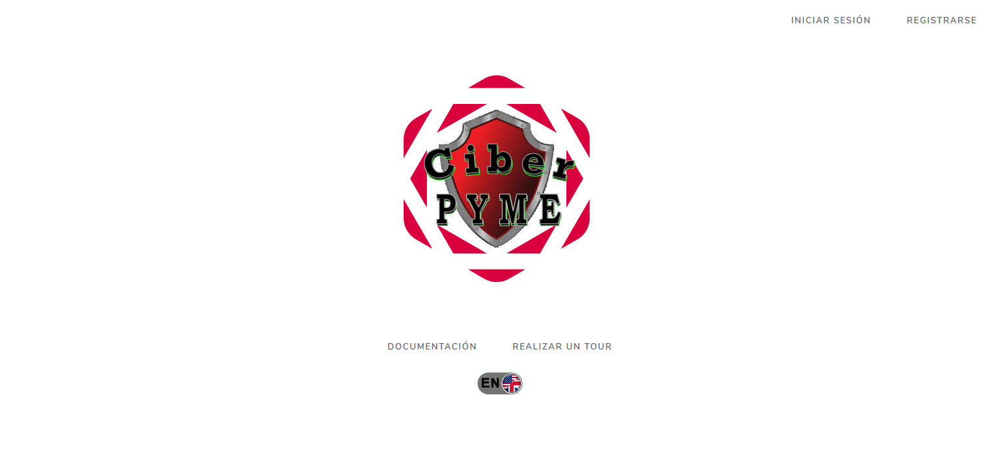

# Título del Proyecto

CiberPYME ha sido creado como proyecto de Fin de Grado para la Universidad Isabel I de Burgos por mi. Lo presenté como parte de un proyecto más grande que implicaba una Guía para la creación de un Plan de Seguridad Informática en un entorno empresarial mediano o pequeño (autónomos, trabajadores, pymes, etc).

Para desarrollar el proyecto se ha usado el [frameword Laravel](https://github.com/laravel/laravel) por su robustez y facilidad de uso, además de por tener una curva de aprendizaje sencilla. El programa tiene la misma [licencia MIT](./LICENCIA.txt) que Laravel.

CiberPYME sirve para realizar un Análisis de Riesgos Sencillos basándonos en la metodología Magerit que edita el [Edita: © Ministerio de Hacienda y Administraciones Públicas](https://administracionelectronica.gob.es/pae_Home/pae_Documentacion/pae_Metodolog/pae_Magerit.html). Al ser una prueba de concepto me he tomado algunas licencias, sobretodo en el cálculo del peso de las salvaguardas y las vulnerabilidades (suman un nivel de riesgo o bajan un nivel de riesgo, en lugar de hacer cálculos más complicados).

 

La pantalla principal utiliza el sistema de login de Laravel.

### Pre-requisitos 📋

Para la instalación de un proyecto necesitamos una máquina virtual XAMPP. Ve las instrucciones de Instalación para más detalles.

### Instalación 🔧

Aquí está contenido todo el código fuente del proyecto en Laravel. Pero se puede instalar una copia completamente funcional en un servidor local XAMPP o en un 
Para instalar una copia del programa CiberPYME y ejecutarla en local se deben seguir los siguientes pasos, adaptándolos al entorno que se haya escogido.

1.- Crear un servidor local con XAMPP
2.- Subir la carpera ciberpyme a la carpeta HTDOCS de XAMPP
3.- Abrir la interfaz de MySQL y crear una nueva base de datos llamada "ciberpyme".
4.- Importar el archivo SQL en la base de datos a través de MySQL.
5.- Modificar los HTACCESS de la carpeta raiz y de la carpeta public para gestionar los redireccionamientos correspondientes del TOMCAT.
6.- Modificar el .env de la carpeta raiz de ciberpyme para reflejar los cambios correspondientes a la conexión con la base de datos y el entorno de desarrollo.

Se incluyen los ejemplos de HTACCESS y .env para un proyecto local y para un servidor en internet. Se pueden encontrar todos los archivos necesarios para la configuración y para la Base de Datos en la carpeta "Archivos de Configuración" de Github

## Que se ha implementado hasta ahora ⚙️

- Gestión de usuarios y sus análisis de riesgos.
- Añadir y eliminar nuevos activos y amenazas usando DataTables.
- Añadir y eliminar Salvaguardas y Vulnerabilidades, y establecer riesgos y decisiones usando Colecciones de Laravel y otros sistemas de arrays.
- Verificación de que se introducen datos correctos en PHP. Lanza mensajes de error en caso de no poder guardar en base de datos, falten datos por introducir o estén los campos vacíos. Muestra mensajes de éxito si el guardado ha ido bien.
- Exportar en PDF datos de una tabla con PHP y Javascript.
- Resaltar las filas de una tabla que concuerdan con un índice de Riesgo. Se señalan en rojo en el Análisis de Riesgos.

Al ser un proyecto realizado en tan solo dos meses, desde cero, esperoo que contenga bugs y fallos facilmente solucionables. Además, una refactorización no le vendría mal.

## Construido con 🛠️

El proyecto ha sido desarrollado en dos meses, aprendiendo **Laravel** desde cero

* [Laravel](http://www.dropwizard.io/1.0.2/docs/) - El framework web usado
* [DataTables](https://datatables.net/) - las dos primeras vistas están desarrolladas con DataTables
* [typed.js](https://github.com/mattboldt/typed.js/) - Usado para el "huevo de pascua" de la página principal, que lleva a **About**.

## Contribuyendo 🖇️

Si quieres contribuir al proyecto con sugerencias puedes escribirme a mi email: acamfue (A) gmail (p) com. O bien puedes hacer una rama del proyecto y modificarla como gustes. ¡Siéntete Libre!

## Ayuda 📖

Puedes ver como funciona el proyecto en vivo en mi hosting particular (si no lo he borrado): [CiberPYME]( https://ciberpyme.riispain.es/)

En la sección de "Hacer un Tour" tendrás más información.

## Versionado 📌

Esta es la primera versión del programa. No se si se realizarán más o el proyecto finalizará aquí. Pero si haces una rama y mejoras algo, agradecería que me enviases los cambios para hacer una segunda versión mejorada.

## Autor ✒️

* **Alejandro Campos** - *Trabajo Inicial y desarrollo completo* - [linkedIn](https://www.linkedin.com/in/acamfue/)

## Licencia 📄

Este proyecto está bajo la Licencia misma de Laravel, la MIT - mira el archivo [LICENSE.md](LICENSE.md) para más detalles

## Expresiones de Gratitud 🎁

* Primero, gracias a mi tutor del proyecto, Juan Agustín Fraile. Ha sido un apoyo y una ayuda dándome ánimos. 📢
* Después a mi amigo Jose Antonio Moreno. Te debo una cerveza bien fresquita 🍺. 
* Por supuesto a mi familia, que me ha soportado después de tantas horas de programación y estudio 🤓.
* Por último a la [Universidad Isabel I](https://ui1.es) que es donde desarrollé todo mi potencial.
